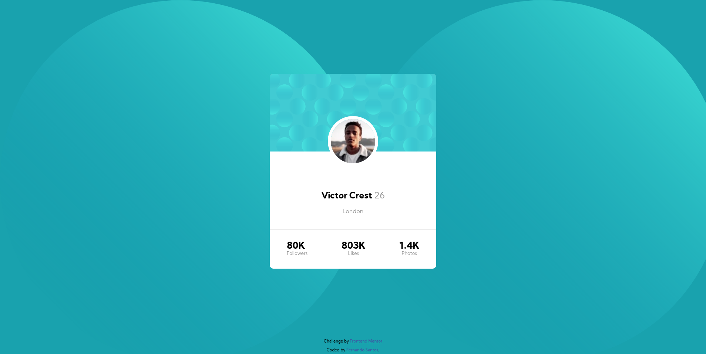

# Frontend Mentor - Profile card component solution

This is a solution to the [Profile card component challenge on Frontend Mentor](https://www.frontendmentor.io/challenges/profile-card-component-cfArpWshJ). Frontend Mentor challenges help you improve your coding skills by building realistic projects.

## Table of contents

- [Overview](#overview)
  - [The challenge](#the-challenge)
  - [Screenshot](#screenshot)
  - [Links](#links)
- [My process](#my-process)
  - [Built with](#built-with)
  - [Continued development](#continued-development)
  - [Useful resources](#useful-resources)
- [Author](#author)
- [Acknowledgments](#acknowledgments)

## Overview

This project was made with only css and html to create a card to a user, and showing their information.

### The challenge

- Build out the project to the designs provided

### Screenshot

### Links

- Solution URL: [Code](https://github.com/fernandochi/profile-challenge-fer.github.io)
- Live Site URL: [Live site](https://fernandochi.github.io/profile-challenge-fer.github.io/)

## My process

Firs I use the atomic design process to decompose the card in parts that I could visualise being a little part of all together. For example, by the images provide, I divide the whole design in three parts, the background, card and footer.
To the background I added the image, meanwhile the footer was created the have the information about from [where](https://www.frontendmentor.io/challenges/profile-card-component-cfArpWshJ) came the project and [who](https://www.linkedin.com/in/fernando-l-santos/) made, in this case me.
Whit the card, I initially thought about divide in three part, the header background, two sections, where would one contain the photo and personal info about the user, and another with info about his numbers on social media. Although the header and footer of the card did not provide any kind of problem, to place the photo and show presonal info in the card inside the same `div` became a problem, so I decide to separate the photo and the info in two diferent sections.

### Built with

- Semantic HTML5 markup
- CSS custom properties
- Flexbox
- Mobile-first workflow

## Author

- Linkedin - [Fernando Luis Santos](https://www.linkedin.com/in/fernando-l-santos/)
- Frontend Mentor - [@fernandochi](https://www.frontendmentor.io/profile/fernandochi)
- GitHub - [@fernandochi](https://github.com/fernandochi)

## Acknowledgments

You maybe have already noticed, but english it's not my first language, while I'm tryng to learn the fast I can, some errors has happened. And the same way that if you who saw my code has any feedback that can help me to be better, I would like to you reach me. Thank you.
